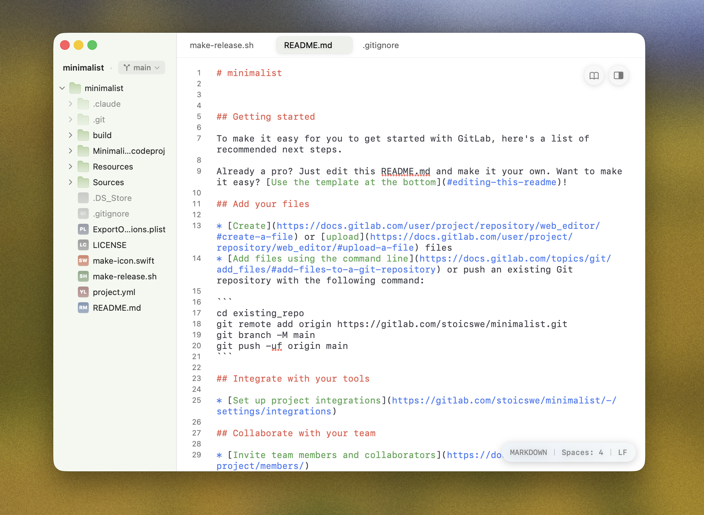

# Minimalist

<picture>
  <source media="(prefers-color-scheme: dark)" srcset="docs/screenshots/dark_mode.png">
  <source media="(prefers-color-scheme: light)" srcset="docs/screenshots/light_mode.png">
  
</picture>

A minimalist text editor for macOS. SwiftUI on top, native AppKit underneath — no chrome you don't ask for, no setting you can't reach.

## Features

- Syntax highlighting for 100+ languages (Highlightr) with selectable light/dark themes
- Markdown rendering with toggleable reader view (swift-markdown-ui)
- Multi-tab, multi-window editing with persistent session recovery
- Git integration: branch display, commit history, per-file revision tracking
- File-tree sidebar with context menus and file-type icons
- Zen mode (`⌘⌃Z`) hides sidebar, tabs, and chrome
- Double-shift command palette for fast file and line jumps
- Code completion using language keywords and identifiers in the current document
- Minimap, external scrollbar, line numbers, word wrap, configurable indentation
- Editor backgrounds (white, sepia, dark) with optional animated patterns: sand, ripples, mist, stars, waves
- Accent color theming with per-element tint toggles
- Glass mode — window-level refraction with a floating tab bar
- iCloud sync for appearance and editor preferences across your Macs

## Requirements

- macOS 26 or later
- Xcode 16+ to build from source
- [XcodeGen](https://github.com/yonaskolb/XcodeGen) (`brew install xcodegen`) to regenerate the project

## Install

Grab the latest signed and notarized `.app` from the [Releases](https://github.com/stoicswe/minimalist/releases) page, unzip it, and drag it into `/Applications`.

## Build from source

```sh
git clone https://github.com/stoicswe/minimalist.git
cd minimalist
xcodegen generate
open Minimalist.xcodeproj
```

To produce a Developer ID–signed, notarized, stapled distribution zip locally:

```sh
./make-release.sh
```

See the comments at the top of [make-release.sh](make-release.sh) for one-time notarization setup.

## Project layout

```
Sources/
  MinimalistApp.swift         App entry point
  ContentView.swift           Root window content
  Editor/                     Text editor (NSViewRepresentable bridge to NSTextView)
  Sidebar/                    File tree
  TopBar/                     Tabs and titlebar
  Workspace/                  Folder/session state
  Git/                        Branch and revision integration
  Settings/                   Preferences UI
  Brand/                      Theming, accent colors, glass effects
  Util/
Resources/
  Assets.xcassets             App icon and assets
  Info.plist
  Minimalist.entitlements
```

## License

[MIT](LICENSE) © Nathaniel Knudsen
