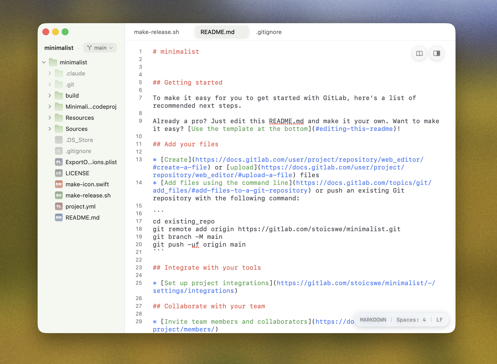

<a href="https://apps.apple.com/us/app/m-txt-minimal-text-editor/id6764609511?mt=12&itscg=30200&itsct=apps_box_artwork&mttnsubad=6764609511" style="position: relative; width: 20px; height: 20px; overflow: hidden; display: inline-block; vertical-align: middle; 
    --app-icon-mask: url('data:image/svg+xml,%0A%3Csvg%20xmlns%3D%22http%3A%2F%2Fwww.w3.org%2F2000%2Fsvg%22%20xml%3Aspace%3D%22preserve%22%20viewBox%3D%220%200%20230.5%20230.5%22%3E%0A%20%20%3Cpath%20fill-rule%3D%22evenodd%22%20stroke-linejoin%3D%22round%22%20stroke-miterlimit%3D%221.4%22%20clip-rule%3D%22evenodd%22%20d%3D%22M158.2%20230H64.1a320%20320%200%200%201-7-.1c-5%200-10-.5-15-1.3a50.8%2050.8%200%200%201-14.4-4.8%2048.2%2048.2%200%200%201-21-21%2050.9%2050.9%200%200%201-4.8-14.4%20100.7%20100.7%200%200%201-1.3-15v-7l-.1-8.2V64.1a320%20320%200%200%201%20.1-7c0-5%20.5-10%201.3-15a50.7%2050.7%200%200%201%204.8-14.4%2048.2%2048.2%200%200%201%2021-21%2051%2051%200%200%201%2014.4-4.8c5-.8%2010-1.2%2015-1.3a320%20320%200%200%201%207%200l8.2-.1h94.1a320%20320%200%200%201%207%20.1c5%200%2010%20.5%2015%201.3a52%2052%200%200%201%2014.4%204.8%2048.2%2048.2%200%200%201%2021%2021%2050.9%2050.9%200%200%201%204.8%2014.4c.8%205%201.2%2010%201.3%2015a320%20320%200%200%201%20.1%207v102.3l-.1%207c0%205-.5%2010-1.3%2015a50.7%2050.7%200%200%201-4.8%2014.4%2048.2%2048.2%200%200%201-21%2021%2050.8%2050.8%200%200%201-14.4%204.8c-5%20.8-10%201.2-15%201.3a320%20320%200%200%201-7%200l-8.2.1z%22%2F%3E%0A%3C%2Fsvg%3E%0A');">svg xmlns="http://www.w3.org/2000/svg" viewBox="0 0 230.5 230.5" style="position: absolute; top: 0; left: 0; width: 100%; height: 100%; pointer-events: none; box-sizing: border-box;"><path fill="none" stroke="#000" stroke-linejoin="round" stroke-miterlimit="1.4" stroke-opacity=".1" stroke-width="1" d="M158.2 230H64.1a320 320 0 0 1-7-.1c-5 0-10-.5-15-1.3a50.8 50.8 0 0 1-14.4-4.8 48.2 48.2 0 0 1-21-21 50.9 50.9 0 0 1-4.8-14.4 100.7 100.7 0 0 1-1.3-15v-7l-.1-8.2V64.1a320 320 0 0 1 .1-7c0-5 .5-10 1.3-15a50.7 50.7 0 0 1 4.8-14.4 48.2 48.2 0 0 1 21-21 51 51 0 0 1 14.4-4.8c5-.8 10-1.2 15-1.3a320 320 0 0 1 7 0l8.2-.1h94.1a320 320 0 0 1 7 .1c5 0 10 .5 15 1.3a52 52 0 0 1 14.4 4.8 48.2 48.2 0 0 1 21 21 50.9 50.9 0 0 1 4.8 14.4c.8 5 1.2 10 1.3 15a320 320 0 0 1 .1 7v102.3l-.1 7c0 5-.5 10-1.3 15a50.7 50.7 0 0 1-4.8 14.4 48.2 48.2 0 0 1-21 21 50.8 50.8 0 0 1-14.4 4.8c-5 .8-10 1.2-15 1.3a320 320 0 0 1-7 0l-8.2.1z" clip-rule="evenodd" vector-effect="non-scaling-stroke"/></svg></a>
# {m.Txt}: Minimal Text Editor (Minimalist)
The text editor for the rest of us. No AI, no excess, no plugins or agents.

<picture>
  <source media="(prefers-color-scheme: dark)" srcset="docs/screenshots/dark_mode.png">
  <source media="(prefers-color-scheme: light)" srcset="docs/screenshots/light_mode.png">
  
</picture>

<a href="https://apps.apple.com/us/app/m-txt-minimal-text-editor/id6764609511?mt=12&itscg=30200&itsct=apps_box_badge&mttnsubad=6764609511" style="display: inline-block;"> </a>
    

A minimalist text editor for macOS. SwiftUI on top and native AppKit running in the background for a simple user interface.

## Features

- Syntax highlighting for 100+ languages (Highlightr) with selectable light/dark themes
- Markdown rendering with toggleable reader view (swift-markdown-ui)
- Multi-tab, multi-window editing with persistent session recovery
- Git integration: branch display, commit history, per-file revision tracking
- File-tree sidebar with context menus and file-type icons
- Zen mode (`⌘⌃Z`) hides sidebar, tabs, and chrome
- Double-shift command palette for fast file and line jumps
- Code completion using language keywords and identifiers in the current document
- Minimap, external scrollbar, line numbers, word wrap, configurable indentation
- Editor backgrounds (white, sepia, dark) with optional animated patterns: sand, ripples, mist, stars, waves
- Accent color theming with per-element tint toggles
- Glass mode — window-level refraction with a floating tab bar
- iCloud sync for appearance and editor preferences across your Macs

## Requirements

- macOS 26 or later
- Xcode 16+ to build from source
- [XcodeGen](https://github.com/yonaskolb/XcodeGen) (`brew install xcodegen`) to regenerate the project

## Install

Grab the latest signed and notarized `.app` from the [Releases](https://github.com/stoicswe/minimalist/releases) page, unzip it, and drag it into `/Applications`.

## Build from source

```sh
git clone https://github.com/stoicswe/minimalist.git
cd minimalist
xcodegen generate
open Minimalist.xcodeproj
```

## License
[MIT](LICENSE) © Nathaniel Knudsen
